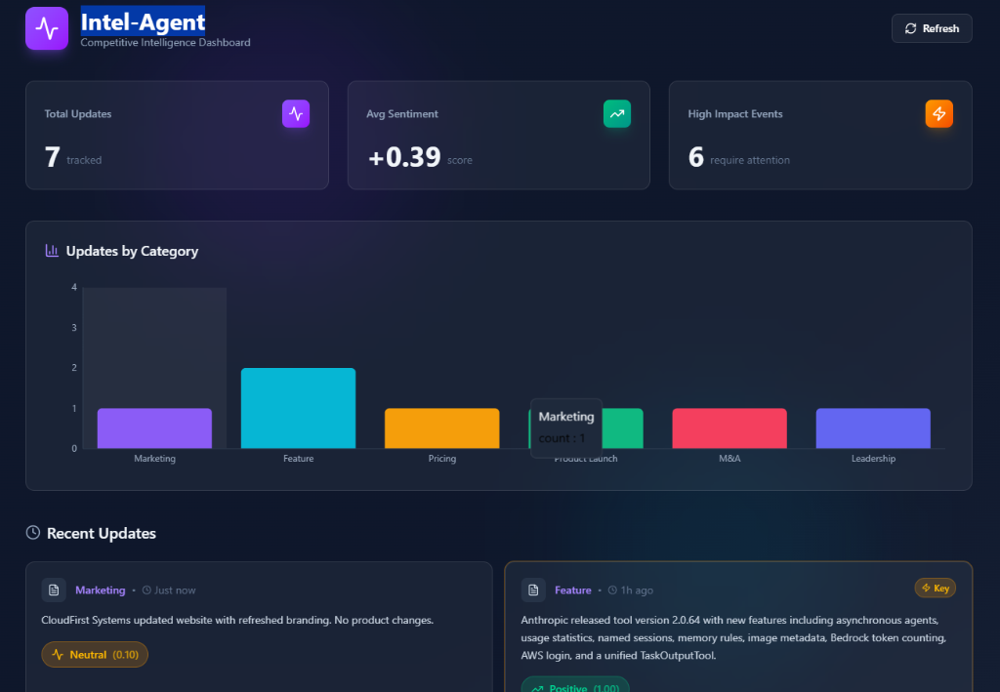
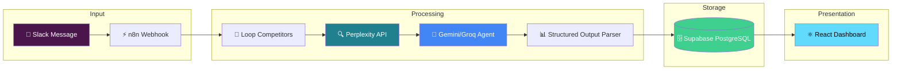
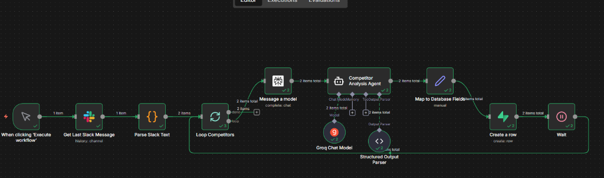

<div align="center">

# 🎯 Intel-Agent

### Automated Competitive Intelligence System

*Turn market noise into actionable insights with AI-powered competitor tracking*

[](https://react.dev/)
[](https://vite.dev/)
[](https://supabase.com/)
[](https://n8n.io/)



</div>

---

## 📌 The Problem

Product teams waste **hours every week** manually tracking competitors:

- 🔄 **Repetitive Research** — Checking the same websites, blogs, and social channels daily
- 📢 **Signal vs. Noise** — Sifting through marketing fluff to find real product updates
- 🧠 **Context Switching** — Jumping between Slack, spreadsheets, and dashboards
- ⏰ **Stale Intel** — By the time insights reach decision-makers, they're outdated

> *"I need to know what competitors are doing — but I don't have time to become a full-time analyst."*

---

## 💡 The Solution

**Intel-Agent** is a fully automated market intelligence pipeline that:

1. **Listens** — Triggers from Slack when you mention competitor names
2. **Researches** — Uses Perplexity AI for real-time web research
3. **Analyzes** — Extracts structured insights with Gemini/Groq LLMs
4. **Stores** — Persists to Supabase with sentiment scores and categories
5. **Visualizes** — Displays everything in a beautiful React dashboard

**Zero manual effort. Always up-to-date.**

---

## 🏗️ System Architecture



---

## 🔧 Technical Deep Dive

### n8n Automation Workflow

The heart of Intel-Agent is a sophisticated n8n workflow that orchestrates the entire intelligence pipeline:



#### Workflow Nodes Explained

| Node | Purpose |
|------|---------|
| **Slack Trigger** | Captures messages from a dedicated #competitor-intel channel |
| **Parse Slack Text** | Extracts competitor names from the message body |
| **Loop Competitors** | `SplitInBatches` node for sequential processing (avoids rate limits) |
| **Perplexity API** | Real-time web search with `sonar-pro` model for latest news |
| **Competitor Analysis Agent** | LLM agent with structured output parsing |
| **Groq Chat Model** | Fast inference for sentiment analysis and categorization |
| **Structured Output Parser** | Enforces JSON schema for consistent data extraction |
| **Map to Database Fields** | Transforms LLM output to match Supabase schema |
| **Create a Row** | Inserts the structured update into PostgreSQL |
| **Wait** | Rate limiting between API calls (prevents 429 errors) |

#### Why Loop with SplitInBatches?

```
❌ Parallel Processing → Rate limits, partial failures, debugging nightmare
✅ Sequential Looping → Individual error handling, graceful retries, clean logs
```

Each competitor is processed independently, so a failure on one doesn't break the entire batch.

---

## 📊 Dashboard Features

### Real-Time Analytics

| Metric | Description |
|--------|-------------|
| **Total Updates** | Count of all tracked competitor activities |
| **Avg Sentiment** | Aggregate sentiment score (-1 to +1 scale) |
| **High Impact Events** | Updates flagged as strategically significant |

### Visual Components

- 📈 **Category Bar Chart** — Distribution of updates by type (Feature, Pricing, M&A, Marketing, Leadership)
- 🎴 **Update Cards** — Glassmorphism cards with sentiment badges
- 🏷️ **Smart Tags** — Auto-categorization with "Key" indicators for critical updates

### Sentiment Analysis

| Score Range | Label | Badge Color |
|-------------|-------|-------------|
| > 0.5 | Positive | 🟢 Green |
| -0.5 to 0.5 | Neutral | 🟡 Amber |
| < 0 | Negative | 🔴 Red |

---

## 🚀 Quick Start

### Prerequisites

- Node.js 18+
- Supabase account (free tier works)
- n8n instance (cloud or self-hosted)

### 1. Clone & Install

```bash
git clone https://github.com/2007Sachin/Intel-Agent.git
cd Intel-Agent
npm install
```

### 2. Database Setup

Run this SQL in **Supabase SQL Editor**:

```sql
CREATE TABLE competitor_updates (
  id BIGINT GENERATED BY DEFAULT AS IDENTITY PRIMARY KEY,
  summary TEXT NOT NULL,
  sentiment_score FLOAT,
  category TEXT,
  is_significant BOOLEAN,
  created_at TIMESTAMPTZ DEFAULT NOW(),
  CONSTRAINT unique_summary UNIQUE (summary)
);

-- Performance indexes
CREATE INDEX idx_category ON competitor_updates(category);
CREATE INDEX idx_created_at ON competitor_updates(created_at DESC);
```

### 3. Environment Variables

Create a `.env` file in the project root:

```env
VITE_SUPABASE_URL=https://your-project.supabase.co
VITE_SUPABASE_ANON_KEY=your-anon-key
```

### 4. Run Development Server

```bash
npm run dev
```

Open [http://localhost:5173](http://localhost:5173) 🎉

---

## 🔑 Environment Variables

| Variable | Description | Where to Find |
|----------|-------------|---------------|
| `VITE_SUPABASE_URL` | Supabase project URL | Dashboard → Settings → API |
| `VITE_SUPABASE_ANON_KEY` | Public anonymous key | Dashboard → Settings → API |

For the n8n workflow, you'll also need:

| Variable | Description |
|----------|-------------|
| `PERPLEXITY_API_KEY` | For real-time web search |
| `GROQ_API_KEY` or `GEMINI_API_KEY` | For LLM inference |
| `SUPABASE_SERVICE_KEY` | For database writes (service role) |

---

## ✨ Key Features

### 🎯 Real-Time "Vibe Check"
Every update is scored for sentiment using LLM analysis. Instantly see if competitor news is positive (new features, funding) or negative (layoffs, outages).

### 🧹 Automated "Fluff Filtering"
The LLM agent strips marketing jargon and extracts only the substance. No more reading through PR-speak to find the actual news.

### 📱 Responsive Bento-Grid Dashboard
Glassmorphism design with backdrop blur effects. Works beautifully on desktop and mobile.

### 🔄 Event-Driven Architecture
Updates flow in real-time from Slack to dashboard. No polling, no cron jobs — pure push-based updates.

---

## 🛠️ Tech Stack

| Layer | Technology |
|-------|------------|
| **Frontend** | React 19, Vite, Tailwind CSS, Recharts, Lucide Icons |
| **Backend** | Supabase (PostgreSQL + Row Level Security) |
| **Automation** | n8n (Workflow Orchestration) |
| **AI/ML** | Perplexity API, Google Gemini, Groq |
| **Styling** | Glassmorphism, CSS Custom Properties |

---

## 📁 Project Structure

```
Intel-Agent/
├── src/
│   ├── App.jsx           # Main dashboard component
│   ├── lib/
│   │   └── supabase.js   # Supabase client config
│   ├── index.css         # Tailwind + custom styles
│   └── main.jsx          # React entry point
├── .env.example          # Environment template
├── vite.config.js        # Vite + Tailwind config
└── package.json          # Dependencies
```

---

## 🤝 Contributing

Contributions are welcome! Please feel free to submit a Pull Request.

---

## 📄 License

MIT License — feel free to use this for your own projects.

---

<div align="center">

**Built with ❤️ for the AI Product Associate role**

*Demonstrating full-stack automation, AI integration, and product thinking*

</div>
